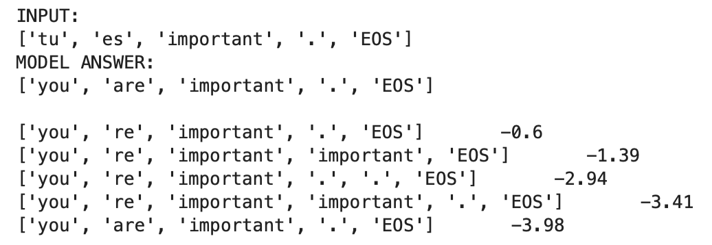

# attention_seq2seq

We set up a toy French to English translation task, implement the attentional seq2seq architecture of [Luong et al. (2015)](https://arxiv.org/pdf/1508.04025) in PyTorch, wrap it into a training loop and train a model after some experimentation:

                  
We can then feed French into the model and use beam search to get its take on some probable translations:

write-up.ipynb - provides the best way into the repo.

dataprep.ipynb, 
model_train.ipynb, 
model_investigate.ipynb - run through the high-level coding and steps.

dataprep_functions.py, 
model_functions.py     - key Python functions.

