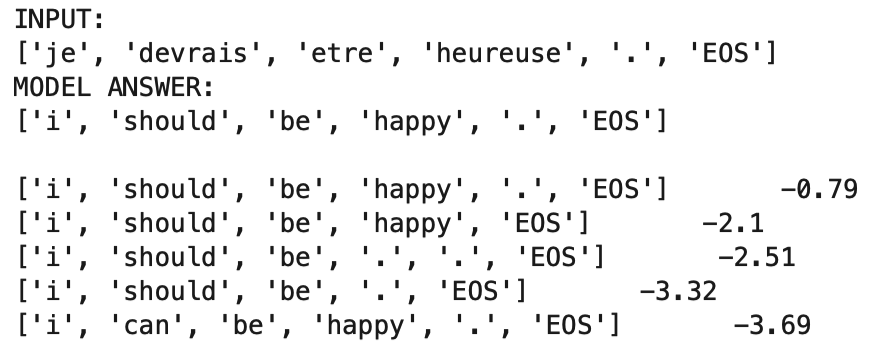

# attention_seq2seq

We set up a toy French to English translation task, __implement the attentional seq2seq architecture of [Leung et al. (2015)](https://arxiv.org/pdf/1508.04025)__ in PyTorch, wrap it into a training loop and train a model, after some experimentation:

                  
We can then feed French into the model and use beam search to get its take on some probable translations:

